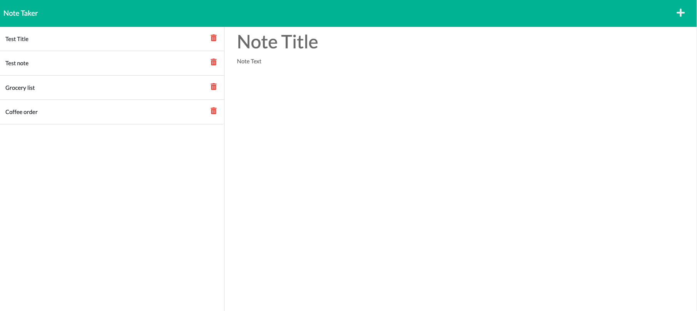
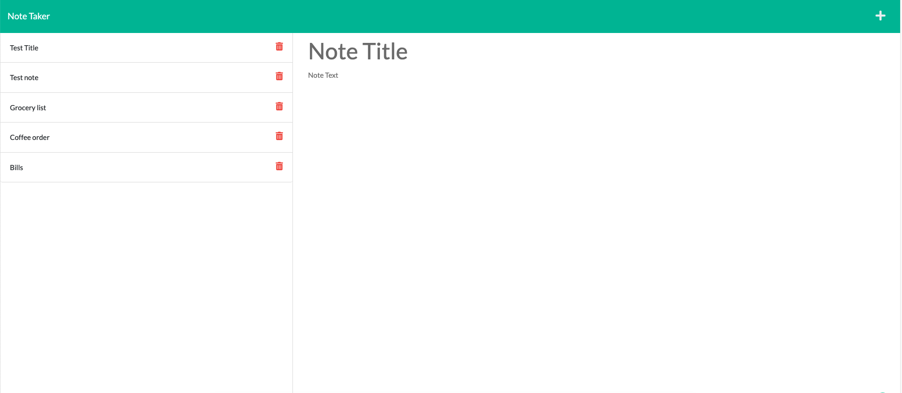

# Note Taker
### Description
For this challenge, my goal was to connect the pre-existing front end of an application and build out the back end of an application. The application allows users to create and save notes.
This application is built using Express.js. Notes are saved and retrieved via a JSON file and the application is deployed to Heroku.

## Visuals 
 
 
  ## Resources 
 * [Live Site](https://untjala.github.io/note-taker/)
 * [Repository](https://github.com/untjala/note-taker)
 * [Heroku](https://fast-peak-15256.herokuapp.com/)